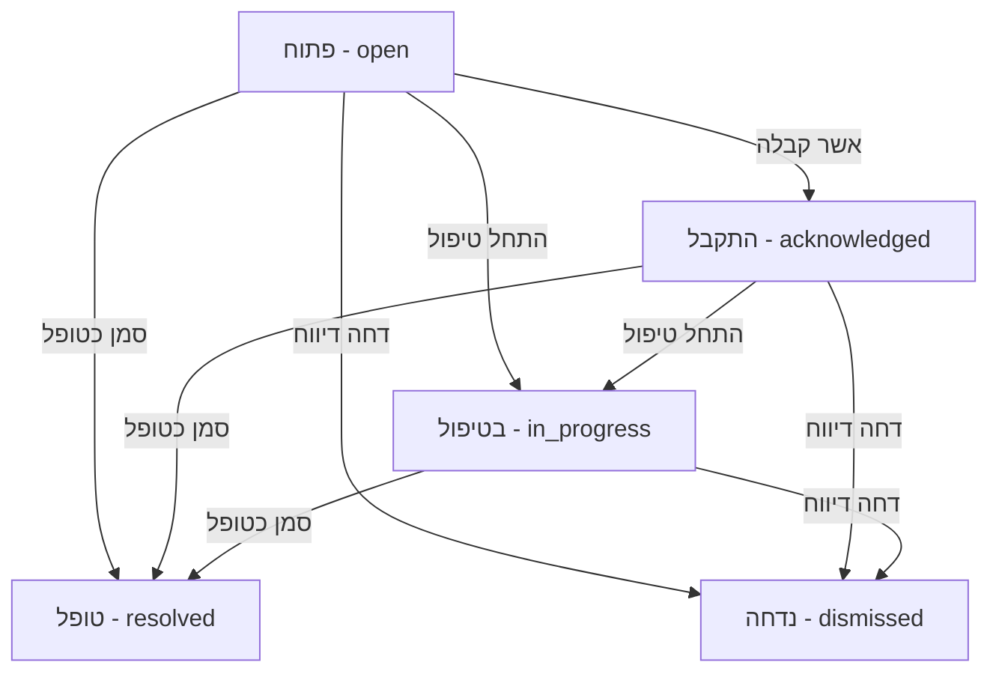

# מחזור חיי דיווח וניהול סטטוסים (Incident Operations Workflow)

מסמך זה מתאר את מחזור חיי הדיווח (Incident Lifecycle), חוקי עדכון הסטטוס, ניהול זמני תגובה (SLA) ותיעוד הפעולות ב-CleanPulse.

---

## מחזור חיי הדיווח וסטטוסים

דיווח במערכת עובר את הסטטוסים הבאים:

### 1. פתוח (open)
* **תיאור**: הסטטוס ההתחלתי של כל דיווח הנוצר ממסך טאבלט ציבורי או מסריקת QR.
* **עדיפות**: נקבעת על פי חומרת התקלה ב-seed או `"medium"` לדירוגים.

### 2. התקבל (acknowledged)
* **תיאור**: חבר צוות אישר שהוא ראה את התקלה וקיבל אחריות לפתור אותה.
* **שדות מתעדכנים**: `acknowledgedAt = הזמן הנוכחי`.
* **לוג**: נרשם activity log ב-action `status_acknowledged`.

### 3. בטיפול (in_progress)
* **תיאור**: חבר הצוות התחיל פיזית לטפל בתקלה (למשל: יצא להביא נייר או סבון, או מנקה כעת).
* **שדות מתעדכנים**: `inProgressAt = הזמן הנוכחי`.
* **לוג**: נרשם activity log ב-action `status_in_progress`.

### 4. טופל (resolved)
* **תיאור**: התקלה נפתרה בשטח.
* **שדות מתעדכנים**:
  - `resolvedAt = הזמן הנוכחי`.
  - `resolvedByUserId = מזהה המשתמש שביצע את הפעולה`.
  - `resolutionNote = הערת פתרון אופציונלית מהמשתמש`.
* **לוג**: נרשם activity log ב-action `status_resolved`.

### 5. נדחה (dismissed)
* **תיאור**: הדיווח נפסל (למשל: דיווח ספאם, כפתור שנלחץ בטעות על ידי ילד, או דיווח כפול שכבר מטופל).
* **שדות מתעדכנים**:
  - `dismissedAt = הזמן הנוכחי`.
  - `resolutionNote = הערת הסבר אופציונלית מדוע נדחה`.
* **לוג**: נרשם activity log ב-action `status_dismissed`.

---

## אכיפת הרשאות (Role Permissions)

* **בעלים / אדמין** (`owner`, `admin`): רשאים לראות את כל הדיווחים ולבצע את כל שינויי הסטטוסים.
* **מנהל סניף / צוות ניקיון** (`manager`, `cleaner`): רשאים לראות את הדיווחים השייכים לארגונם ולשנות את סטטוס הטיפול שלהם.
* **אימות ארגוני מחמיר**: כל בדיקות הסטטוסים מבוצעות בשרת באמצעות מזהה הארגון של ה-Session. לא ניתן לבצע פעולה על דיווח ששייך לארגון אחר (הפונקציה `getIncidentById` תחסום גישה כזו מיידית).

---

## ניהול SLA וזמני תגובה (SLA Thresholds)

המערכת מחשבת ומציגה 3 מדדי זמנים לכל דיווח:
1. **זמן לתגובה (Time to Acknowledge)**: ההפרש בין פתיחת האירוע לבין `acknowledgedAt`.
2. **זמן להתחלה (Time to In-Progress)**: ההפרש בין פתיחת האירוע לבין `inProgressAt`.
3. **זמן לסגירה (Time to Resolution)**: ההפרש בין פתיחת האירוע לבין `resolvedAt` (או `dismissedAt`).

### רמות SLA לדיווחים פתוחים (מדד זמן שעבר):
* **תקין (Normal)**: דיווח שפתוח פחות מ-10 דקות (תצוגה בכחול/ניטרלי).
* **דורש תשומת לב (Warning)**: דיווח שפתוח בין 10 ל-30 דקות (תצוגה בכתום).
* **חריג SLA (Danger / Overdue)**: דיווח שפתוח מעל 30 דקות (תצוגה באדום עדין).

*הערה: זמני ה-SLA משתקפים ברמת רשימת הדיווחים וברמת דף פרטי האירוע.*

---

## הוראות לבדיקה ידנית

1. **התחברות כמנהל**:
   התחבר למערכת הניהול בכתובת `/login` עם הפרטים:
   - מייל: `owner@demo.local`
   - סיסמה: `Demo123456!`
2. **פתיחת רשימת דיווחים**:
   נווט ל-[/admin/incidents](http://localhost:3000/admin/incidents).
   - ודא שאתה רואה את כל המסננים (חיפוש, סטטוס, סניף, אזור שירותים, סוג תקלה, מקור).
   - נסה לסנן לפי סטטוס "פתוח" וודא שהרשימה מסתננת בצורה מיידית.
   - ודא שמוצג כפתור "רענן נתונים" ושהוא מבצע רענון של הרשימה (בנוסף לפולינג אוטומטי שמתבצע כל 12 שניות).
3. **כניסה לפרטי דיווח**:
   לחץ על כפתור "פתיחה וטיפול" של אחד הדיווחים כדי להגיע ל-[/admin/incidents/[id]](http://localhost:3000/admin/incidents/incident_demo_1).
   - ודא שמוצגת טבלת פרטי המיקום, מדדי ה-SLA, לוח הפעולות, ה-Timeline של הפעולות ולוגי התראות המייל.
4. **ביצוע אישור קבלה (Open -> Acknowledged)**:
   - לחץ על לחצן **"אשר קבלה"** בלוח הפעולות.
   - ודא שסטטוס הדיווח משתנה ל-"התקבל".
   - ודא ששדה `acknowledgedAt` מציג את השעה הנוכחית ומחשב את הזמן שלקח לאשר.
   - ודא שה-Timeline מציג שורה חדשה: "אישור קבלת דיווח" המבוצעת על ידי "בעלים דמו".
5. **התחלת טיפול (Acknowledged -> In Progress)**:
   - לחץ על לחצן **"התחל טיפול"**.
   - ודא שסטטוס הדיווח משתנה ל-"בטיפול".
   - ודא שנוספה שורת פעילות חדשה ב-Timeline.
6. **סגירת הדיווח (In Progress -> Resolved)**:
   - הזן הערה בשדה "הערת סגירה / פתרון" (למשל: "הותקן סבון חדש במיכל").
   - לחץ על לחצן **"סמן כטופל"**.
   - ודא שהדיווח נסגר, השדות `resolvedAt`, `resolvedByUserId` ו-`resolutionNote` התעדכנו.
   - ודא שה-Timeline מציג את ההערה שהקלדת.
   - ודא שלוח הפעולות מציג הודעה: "דיווח זה סגור ולא ניתן לבצע פעולות נוספות."
7. **אימות דשבורד**:
   - נווט חזרה לדשבורד הראשי (`/admin/dashboard`) וודא שדיווחים פתוחים ירדו ב-1 והדיווח שטיפלת בו מופיע כעת בסטטוס "טופל".
